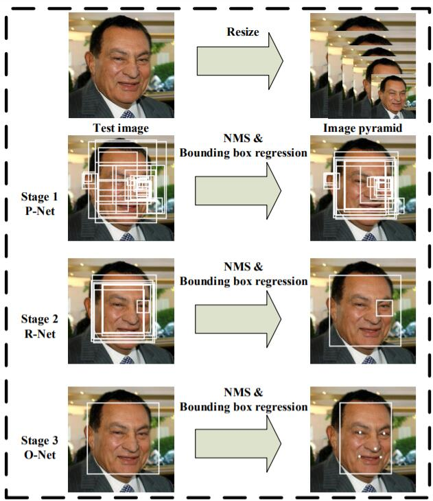
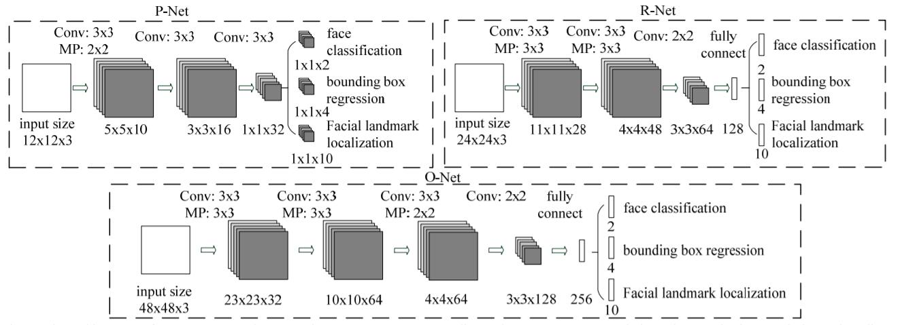
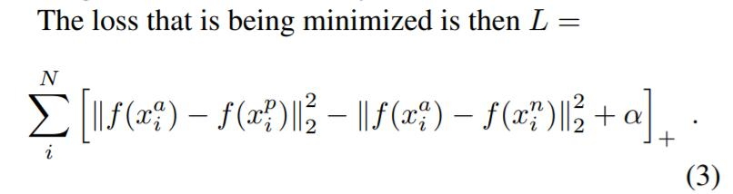
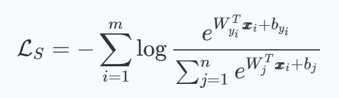
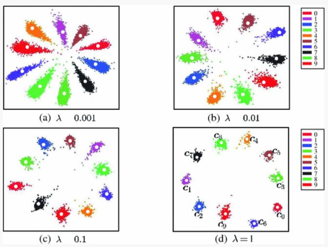
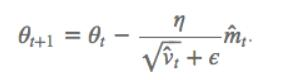
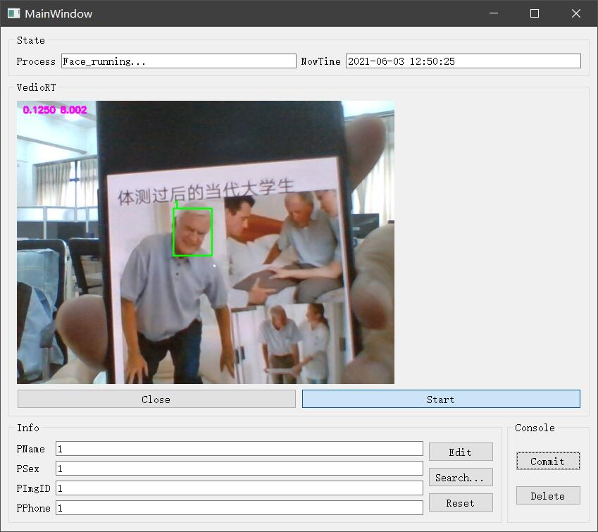
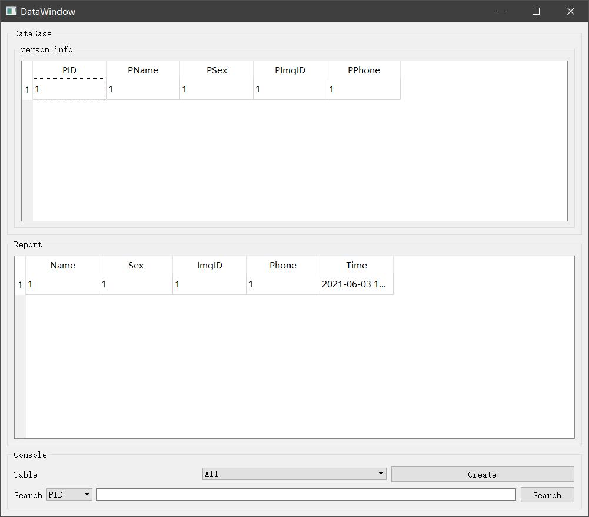

# FACE人脸识别考勤
## 一、目录说明
```text
face
├─ main.py  # 主程序
├─ *UI.py  # qtUI界面
├─ *UI.ui  # qtUI界面
├─ backend  # 后端数据库相关
├─ recognition  # 人脸识别相关
│    ├─ Recognizer.py  # 对识别器做进一步封装
│    ├─ align  # 人脸检测
│    ├─ data  # 该目录被加入到.gitignore中，包括数据集及模型
│    ├─ run  # 识别单元测试
│    │    ├─ embeddings.py
│    │    └─ test.py
│    └─ train  # 训练模型
└─ sql  # SQL语句
       └─ comprehensive_design_3.sql
```
## 二、模型介绍
人脸识别模块基于Tensorflow框架，算法参考[FaceNet](https://arxiv.org/abs/1503.03832) 网络结构，采用[Center_loss](https://link.springer.com/chapter/10.1007%2F978-3-319-46478-7_31) 作为损失函数。
### 1、预处理
[MTCNN](https://kpzhang93.github.io/MTCNN_face_detection_alignment/index.html) 被证明是在复杂场景中非常有效的面部标志检测器。  
模型主要通过三层网络级联(PNet, RNet, ONet)来实现对人脸更精确的检测, 论文中的示例如下：




三层模型依次训练，其中详细说明参考[tensorflow-MTCNN](https://github.com/LeslieZhoa/tensorflow-MTCNN) 。
### 2、模型训练
#### 2.1、损失函数
该部分参考FaceNet的结构，即使用inception_resnet_v1作为模型主体架构，输出一定维度的图片embeddings。  
FaceNet的损失函数采用的是triplet_loss，即对于某张训练图片img,再选取一张同一类别一张图作为pos，选取不同类别的一张图作为neg。  
- img的embeddings与pos的embeddings的平方和作为pos_dist
- img的embeddings和neg的embeddings的平方和作为neg_dist

使pos_dist与neg_dist的差总保持一定阈值，实际训练中在每一batch中对于某一img，选取同一类别图像作为pos，选取embeddings平方和大于pos的不同类别图像作为neg，依次构成三元组来训练模型依次构成三元组来训练模型。  

triplet_loss的公式如下：  


但是这样训练三元组模型收敛极慢，[A Discriminative Feature Learning Approach for Deep Face Recognition](https://link.springer.com/chapter/10.1007%2F978-3-319-46478-7_31) 提出的center_loss可加速模型的收敛。  
公式如下：  


代码中的损失函数采用softmax交叉熵和center_loss相结合。  
softmax交叉熵为了使类间距离变大，center_loss是计算某一图片与该类别图片embeddings的均值的损失，为了使类间距离变小。  
论文中采取minst实验来说明损失函数的功能，如下图所示：  


在实际训练中并不是遍历整个数据集来求取某类别center的embeddings，而是只针对每一个batch中出现的类别的center通过batch内相同类别的图像embeddings来进行一定学习率的更新，未出现该批次的类别的center不进行更新。  

#### 2.2、优化器
优化器采用Adam(Adaptive Moment Estimation)，这个算法是另一种计算每个参数的自适应学习率的方法，相当于 RMSprop + Momentum。  
除了像 Adadelta 和 RMSprop 一样存储了过去梯度的平方 vt 的指数衰减平均值 ，也像 momentum 一样保持了过去梯度 mt 的指数衰减平均值。  
梯度更新规则为：  


## 三、功能介绍
### 1、录入&检测&考勤打卡


### 2、检索


